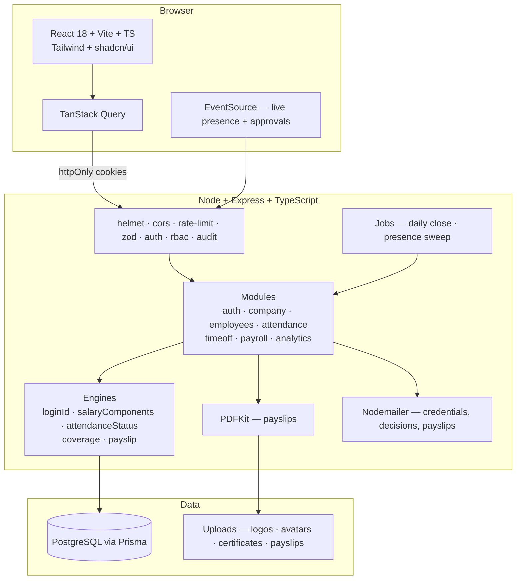
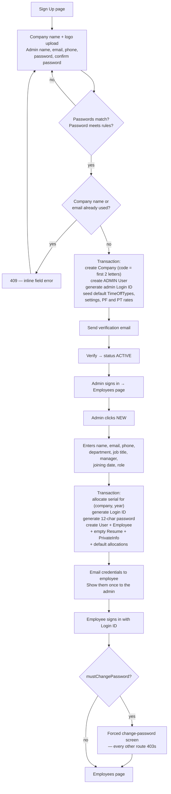
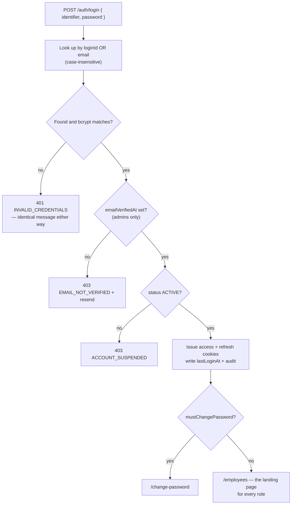
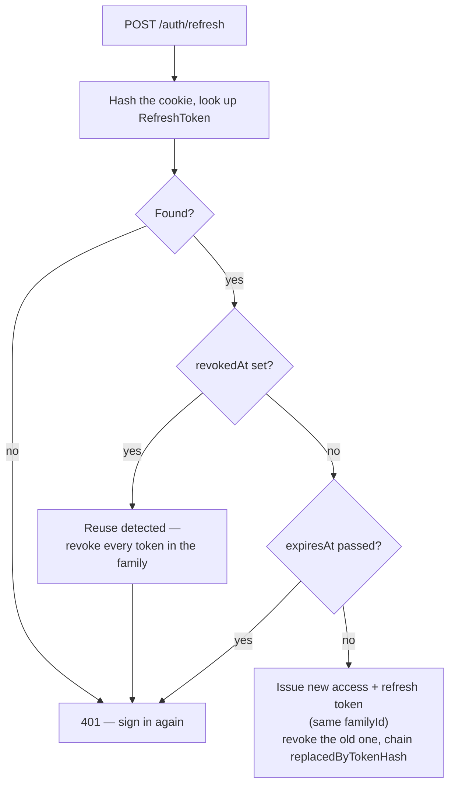
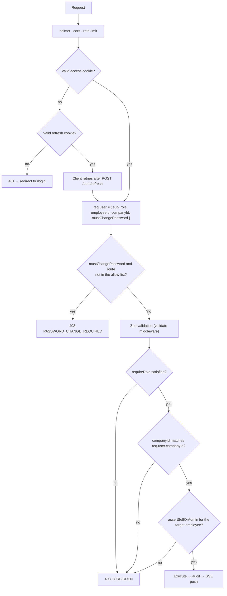
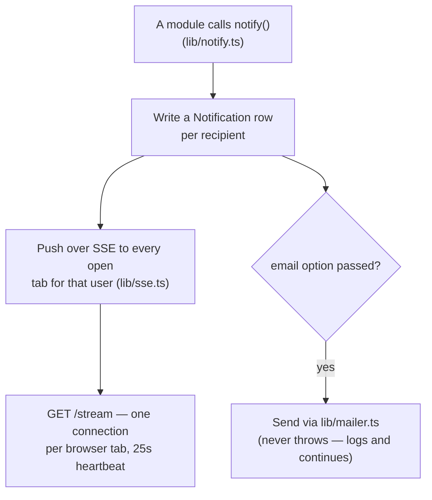

# Dayflow — Architecture

System-level flows, reproduced from `docs/Dayflow-Blueprint-v2.md` §5 and §10 so the
mechanics can be read without opening the code. See `docs/ERD.md` for the data model.

## System architecture

`packages/shared` holds the Zod schemas; the API validates with them and the web app infers
its types from them — one source of truth (`docs/Dayflow-Team-Plan.md` §2.4).

**As of this PR** (Member 1 — Platform & Auth), the modules that exist are `auth`, `company`,
`settings`, `notifications`, `audit` and `health`. `employees`, `profile`, `contracts`,
`payroll`, `attendance`, `time-off` and `analytics` are mounted stub routers awaiting their
owners (M3/M4) — see the gap note in the PR description.

## Company registration and employee onboarding

Implemented in `apps/api/src/modules/auth` (Steps 1–4). The employee-creation half (J–M)
belongs to Step 7 (M3) and is not yet built.

## Sign in

## Refresh-token rotation and reuse detection

A stolen-and-replayed refresh token is the attack this defends against: the legitimate
client's *next* refresh will present a token that's already been revoked-and-replaced by the
attacker's use, which is treated as reuse and kills every token in that family — both parties
get logged out and must sign in again. See `apps/api/src/modules/auth/auth.service.ts`
(`refreshSession`) and the reuse test in `auth.test.ts`.

## Authorisation

**Three guards, not one** — role (`requireRole`), company scope (`requireCompanyScope` /
`scopedPrisma`) and resource ownership (`assertSelfOrAdmin`), all in
`apps/api/src/middleware/auth.ts`. `scopedPrisma(companyId)` (`lib/prisma.ts`) is a Prisma
client extension that injects `where.companyId` on `findMany`/`findFirst` for every
tenant-owned model, so a route can't forget the company filter; the raw `prisma` export is a
deliberate, documented bypass for the handful of places that must cross the tenant boundary
before a companyId is known (registration, login lookup).

## Notifications and realtime

`notify()` is a reusable primitive; the actual trigger points (employee created, time off
submitted/approved, attendance regularised, payslip published) belong to the modules that
raise them — Steps 7–16 — most of which are not yet built.

## What this PR does not cover

Full write-up in the PR description. In short: everything above is the platform substrate
(auth, schema, notifications, settings/audit, seed skeleton, deploy runbook) that Steps 3, 5–16
and 18–19 build on top of. Those steps belong to M2/M3/M4 and have not started in this repo yet.
