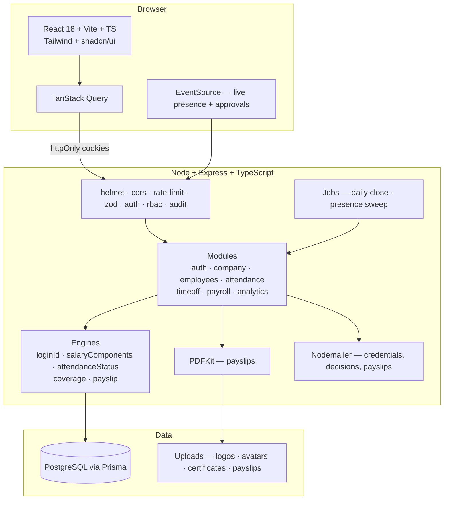
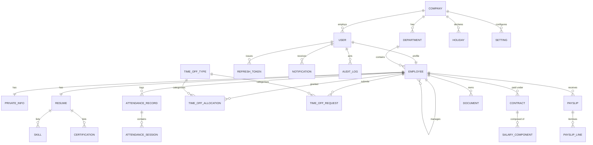
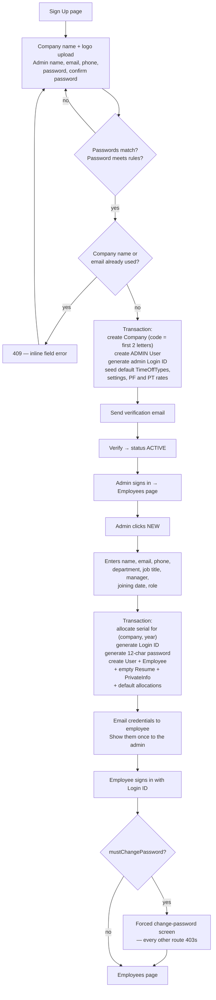
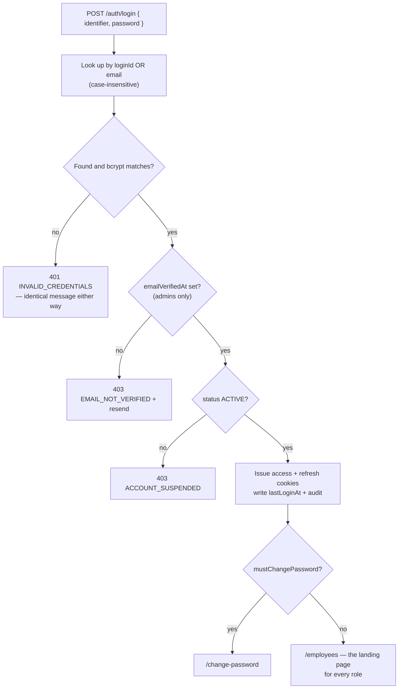
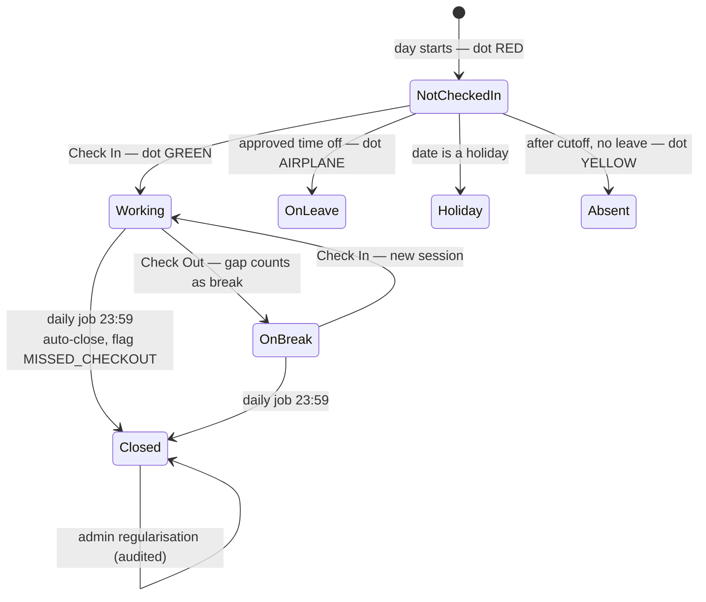
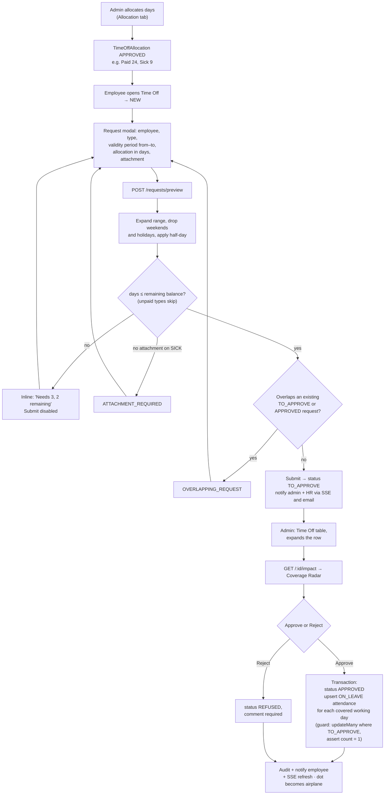
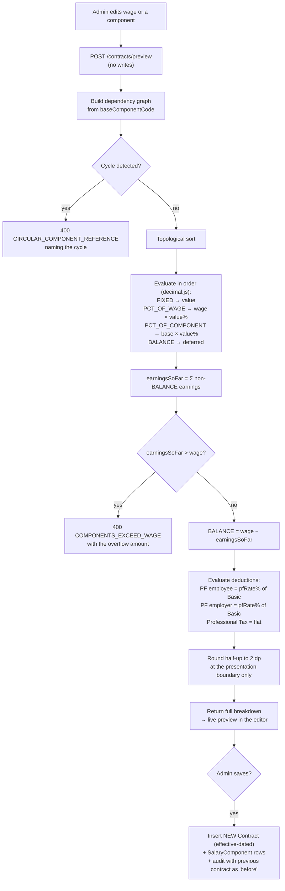
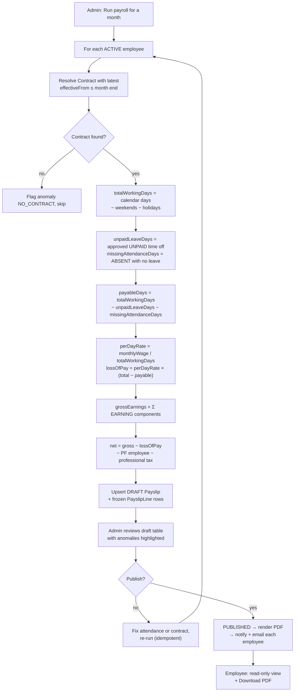
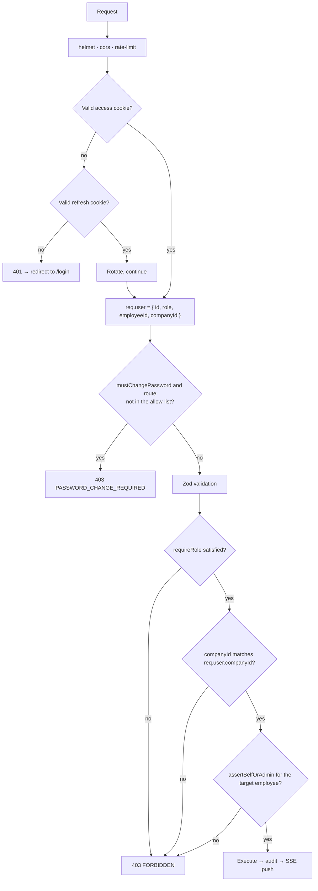

# Dayflow — HRMS Build Blueprint **v2**
### Every workday, perfectly aligned.
**Reconciled against the Excalidraw wireframes. This version supersedes v1.**

---

## 0. What changed from v1, and why it matters

The wireframes contradict my v1 assumptions in five places. Three of them are architectural — build on v1 and you will have to rip things out.

| # | v1 assumed | The board actually specifies | Impact |
|---|---|---|---|
| **A** | Employees self-register with email verification | **Only a company registers.** Sign Up creates the *company + first admin*. HR/Admin then creates every employee, and the system **auto-generates their Login ID and first password**. | Rewrites the whole auth module and the User model. **Biggest change.** |
| **B** | Login by email | Login by **auto-generated Login ID or email**, format `[CO][FN][LN][YYYY][NNNN]` | New ID-generation service, must be race-safe |
| **C** | Flat salary structure with basic/HRA/allowances columns | A **salary component engine**: components computed as fixed amounts, % of wage, or % of another component, auto-recalculating when wage changes, with a balancing component that absorbs the remainder. Plus PF (employee + employer) and Professional Tax. | This is now the single hardest module. Budget 4 hours, not 1. |
| **D** | Sidebar app shell with dashboards | **Four top tabs** — Employees · Attendance · Time Off — with Employees as the landing page. No separate dashboard screen. Check In/Out lives in the top bar systray. | Shell rebuilt; dashboards folded into the tab pages |
| **E** | Leave balances accrue automatically | Time Off has an explicit **Allocation** tab — admins allocate days to employees, and requests draw down against allocations | New entity, new admin screen |

**What survives from v1 unchanged:** the data-integrity discipline (transactions, audit log, effective dating), RBAC with resource-level checks, the design system, the deployment plan, and the two differentiators — repositioned in §3 to sit *inside* the wireframed layouts rather than replacing them.

**A note on the one ambiguity on the board.** The Login ID explanation says the serial is `0001` (four digits) but the worked example reads as three (`…2023001`). I've specced four digits, configurable in company settings. Confirm with the organisers if you can; it's a one-line change either way.

---

# 1. The winning thesis (unchanged, sharpened)

The wireframes describe an Odoo-style HRMS. Every team gets the same board, so **every team will build the same screens**. Pixel-matching the wireframe is the entry ticket, not the win.

You win by building exactly what the board asks for — and then being the only team whose app *helps the user decide* rather than just recording what they typed.

**Three axes:**

1. **Decision support inside the wireframed screens.** The board's Time Off table has a red Reject and a green Approve button per row. Everyone will wire those to a status update. You will make expanding a row reveal a **Coverage Radar** — team coverage on those dates, who else is already off, allocation remaining. Same layout, vastly better product.

2. **The salary engine actually works.** The "Important" note on the board is the most demanding thing on it and the thing most teams will fake with hardcoded fields. Build the real computation graph — change the wage from ₹50,000 to ₹60,000 and watch every component recalculate live, with the Fixed Allowance absorbing the balance. That single interaction is a 15-second demo moment that proves depth.

3. **Attendance genuinely drives payroll.** The board says it twice: attendance is the basis for payslip generation, and unpaid leave or missing attendance must reduce payable days. Demo it as a chain — regularise one attendance day, re-run payroll, watch the net pay change. Most teams will build these as two disconnected modules.

**Pitch sentence:** *"Dayflow implements the whole brief — and then makes the two hardest parts, salary computation and leave approval, actually intelligent."*

---

# 2. Requirement coverage matrix

Now covering both the SRS *and* every annotation on the wireframe board. Print it. Tick it in the final hour.

### From the SRS
| SRS ref | Requirement | Step | ☐ |
|---|---|---|---|
| 3.1.1 | Sign up with role, password rules, email verification | 4 | ☐ |
| 3.1.2 | Sign in, error messages, redirect to landing | 4, 5 | ☐ |
| 3.2.1 | Employee landing with quick access + alerts | 7 | ☐ |
| 3.2.2 | Admin view of employees, attendance, approvals; switch between employees | 7, 8 | ☐ |
| 3.3.1 | View personal, job, salary, documents, photo | 8 | ☐ |
| 3.3.2 | Employee edits limited fields; admin edits all | 8 | ☐ |
| 3.4.1 | Daily/weekly views, check-in/out, status types | 10, 11 | ☐ |
| 3.4.2 | Employee sees own only; admin sees all | 10, 11 | ☐ |
| 3.5.1 | Apply: type, date range, remarks; pending/approved/rejected | 13 | ☐ |
| 3.5.2 | Admin approve/reject with comments, reflects immediately | 14, 17 | ☐ |
| 3.6.1 | Payroll read-only for employees | 16 | ☐ |
| 3.6.2 | Admin views all payroll, updates salary structure | 15, 16 | ☐ |
| §6 | Email & notification alerts | 17 | ☐ |
| §6 | Analytics & reports | 18 | ☐ |

### From the wireframe board
| Board annotation | Step | ☐ |
|---|---|---|
| Sign Up captures Company Name + logo upload | 4 | ☐ |
| Sign Up captures Name, Email, Phone, Password, Confirm Password with show/hide | 5 | ☐ |
| **Normal users cannot register** — HR/Admin creates employees | 4, 8 | ☐ |
| Login ID auto-generated: company(2) + first name(2) + last name(2) + joining year + serial | 4 | ☐ |
| First password auto-generated by system; user can change it after login | 4, 5 | ☐ |
| Login by Login ID **or** email | 4 | ☐ |
| Landing after login = Employees page | 7 | ☐ |
| Employee cards show avatar + basic info, are clickable | 7 | ☐ |
| Clicking a card opens that employee's profile **view-only** | 8 | ☐ |
| Status dot top-right of each card: green = present, airplane = on leave, yellow = absent | 7 | ☐ |
| Avatar dropdown → My Profile, Log Out | 6 | ☐ |
| Check In / Check Out in the systray | 6, 10 | ☐ |
| On successful Check In the red dot turns green | 6, 10 | ☐ |
| Profile tabs: Resume, Private Info, Salary Info, Security | 8, 9 | ☐ |
| Resume tab: About, What I love about my job, My interests and hobbies, Skills, Certifications | 8 | ☐ |
| Private Info: DOB, nationality, personal email, gender, marital status, DOJ, bank details, PAN, UAN, IFSC, Emp Code | 8 | ☐ |
| **Salary Info tab visible to Admin only** | 9 | ☐ |
| Month wage / Yearly wage, working days per week, break time | 9 | ☐ |
| Components: Basic, HRA, Standard Allowance, Performance Bonus, LTA, Fixed Allowance | 9 | ☐ |
| Computation: fixed amount or percentage of wage/component | 9 | ☐ |
| Basic = 50% of wage; HRA = 50% of Basic; Bonus & LTA = 8.33%; Fixed Allowance = wage − Σ others | 9 | ☐ |
| Components auto-update when wage changes | 9 | ☐ |
| Total of components must not exceed the wage | 9 | ☐ |
| PF contribution: employee + employer, configurable rate (12%) | 9 | ☐ |
| Professional Tax, configurable (₹200) | 9 | ☐ |
| Attendance: day-wise, own records, current month by default | 11 | ☐ |
| Attendance shows working time **including breaks** | 10, 11 | ☐ |
| Admin/HR see all employees' attendance for the current day | 11 | ☐ |
| Attendance table: Check In, Check Out, **Work Hours, Extra Hours** | 10, 11 | ☐ |
| Employee attendance header: days present, leaves count, total working days | 11 | ☐ |
| Date navigation ← → with Date/Day toggle | 11 | ☐ |
| **Attendance is the basis for payslip generation** | 15 | ☐ |
| Unpaid leave / missing attendance reduce payable days | 15 | ☐ |
| Time Off tabs: Time Off + **Allocation** | 12, 14 | ☐ |
| Balance headers: Paid Time Off (24 days), Sick Time Off (09 days) | 13 | ☐ |
| Time Off types: Paid Time Off, Sick Leave, Unpaid Leave | 12 | ☐ |
| Admin table: Name, Start Date, End Date, Type, Status + inline reject/approve | 14 | ☐ |
| Employees see only their own time off | 12 | ☐ |
| Employee time off = **full-year calendar view** with legend | 13 | ☐ |
| Request modal: Employee, Type, Validity Period from–to, Allocation (days), Attachment, Submit/Discard | 13 | ☐ |
| Attachment is for sick leave certificates | 13 | ☐ |
| Settings section | 19 | ☐ |

---

# 3. The two differentiators, repositioned

The wireframes are the contract. Both differentiators now live *inside* the specified screens rather than replacing them.

## 3.1 Coverage Radar — inside the Time Off approvals table

The board shows a table row with reject/approve buttons. Keep that exactly. Add: clicking a row expands it in place to reveal the decision packet.

```
POST /api/v1/time-off/:id/impact  →
{
  "allocationAfter": { "type": "Paid Time Off", "allocated": 24, "used": 6, "thisRequest": 2, "remaining": 16 },
  "workingDays": 2,
  "excludedDates": [{ "date": "2025-10-13", "reason": "Public holiday — Dussehra" }],
  "teamCoverage": [
    { "date": "2025-10-12", "headcount": 8, "away": 2, "coverage": 75, "level": "ok" },
    { "date": "2025-10-14", "headcount": 8, "away": 4, "coverage": 50, "level": "risk" }
  ],
  "collisions": [{ "employee": "Priya R.", "designation": "Backend", "dates": "12–14 Oct", "status": "APPROVED" }],
  "flags": ["SECOND_REQUEST_THIS_MONTH", "NO_CERTIFICATE_ATTACHED"]
}
```

Rendered as a compact band of day-cells with coverage bars, the collision list, and remaining allocation — directly above the same approve/reject buttons the board specifies. Thresholds (`ok ≥ 70`, `watch 50–69`, `risk < 50`) live in Settings so you can demo changing them.

## 3.2 The live salary engine — inside the Salary Info tab

The board's "Important" note is the spec. Implement it as a real computation graph, not fields:

```
wage = 50,000
  Basic              PCT_OF_WAGE       50%    → 25,000
  House Rent Allow.  PCT_OF_COMPONENT  50% of Basic → 12,500
  Standard Allowance FIXED             4,567  →  4,567
  Performance Bonus  PCT_OF_COMPONENT  8.33% of Basic → 2,082.50
  Leave Travel Allow.PCT_OF_COMPONENT  8.33% of Basic → 2,082.50
  Fixed Allowance    BALANCE           wage − Σ above → 3,768.00
                                              ─────────
                                       total = 50,000 ✓ (never exceeds wage)

  PF — employee      PCT_OF_COMPONENT  12% of Basic → 3,000   (deduction)
  PF — employer      PCT_OF_COMPONENT  12% of Basic → 3,000   (employer cost)
  Professional Tax   FIXED             200            (deduction)
```

**The demo moment:** change the monthly wage from 50,000 to 60,000 and every dependent component recomputes live, the Fixed Allowance re-absorbs the balance, and the total stays pinned to the wage. Fifteen seconds, and it proves you modelled the problem instead of hardcoding six inputs.

**Rules to enforce:**
- Evaluate in dependency order (topological sort); reject cycles at save time.
- Exactly one `BALANCE` component per contract; it may never go negative — if Σ others > wage, block the save with `COMPONENTS_EXCEED_WAGE` naming the overflow amount.
- Rates for PF and Professional Tax come from company Settings, not hardcoded.
- Contracts are **effective-dated**: changing a wage inserts a new contract row, never mutates the old one, so historic payslips stay correct.

## 3.3 The attendance → payroll chain

The board states it explicitly, so build it explicitly and demo it as one continuous action:

```
payableDays = totalWorkingDaysInMonth − unpaidLeaveDays − missingAttendanceDays
perDayRate  = monthlyWage / totalWorkingDaysInMonth
lossOfPay   = perDayRate × (totalWorkingDays − payableDays)
net         = Σ earnings − lossOfPay − PF(employee) − professionalTax
```

Demo: open one employee's attendance, mark a day absent, re-run payroll, show the net pay drop with the LOP line itemised on the payslip.

## 3.4 The Day Ribbon (kept, as an enhancement not a replacement)

The board specifies tables for attendance, so **the table is the default view**. The Day Ribbon becomes a view toggle beside it and appears inline on the employee card grid as a thin strip under each avatar. You get the visual signature without departing from the brief. If you're short on time, this is the first thing to cut — see §15.

---

# 4. User classes

| Role | Can |
|---|---|
| **Admin** | Everything. Creates employees, sees and edits Salary Info, runs payroll, approves time off, manages allocations and settings |
| **HR Officer** | Everything except Salary Info and payroll — creates employees, manages attendance, approves time off. *(The board says Salary Info is Admin-only; a `canViewPayroll` flag on the role makes this demonstrable.)* |
| **Employee** | Own profile (limited edits), own attendance, own time off, own Resume/Private Info/Security tabs. Sees other employees' cards and view-only profiles, but not their salary, attendance detail or time off |

---

# 5. System architecture



`packages/shared` holds the Zod schemas; the API validates with them and the web app infers its types from them. One source of truth.

---

# 6. Tech stack

Unchanged from v1 — it survives the wireframe reconciliation intact.

| Layer | Choice |
|---|---|
| Repo | pnpm workspaces: `apps/api`, `apps/web`, `packages/shared` |
| Frontend | React 18 + Vite + TypeScript + Tailwind + shadcn/ui |
| State | TanStack Query · React Hook Form + Zod · Recharts · Framer Motion |
| Backend | Node + Express + TypeScript + Prisma |
| DB | PostgreSQL (Neon free tier) |
| Auth | JWT access 15 min + refresh 7 d, httpOnly cookies, rotation with reuse detection |
| Money | `Decimal @db.Decimal(12,2)` in Prisma, `decimal.js` in services. **Never floats.** |
| Mail | Nodemailer → Resend, Ethereal fallback |
| PDF | PDFKit |
| Realtime | Server-Sent Events |
| Deploy | Vercel (web) + Render (api) + Neon (db) |

> **Decimal discipline matters more in v2.** A percentage-of-percentage salary engine computed in JavaScript floats will produce ₹2,082.4999999 on stage. Use `decimal.js` throughout the engine and round only at the presentation boundary, to 2 dp, half-up.

---

# 7. Data model



### Models

**Company** — `name`, `code` (2 uppercase letters, derived from name, editable), `logoUrl`, `address`, `timezone` (default `Asia/Kolkata`), `workDaysPerWeek` (default 5), `standardDailyHours` (default 8), `breakMinutes` (default 60), `pfRateEmployee` (12), `pfRateEmployer` (12), `professionalTax` (200), `serialWidth` (4), `coverageOkThreshold` (70), `coverageRiskThreshold` (50).

**User** — `companyId`, `loginId` (unique, generated), `email` (unique), `phone`, `passwordHash`, `mustChangePassword` (bool), `role` `ADMIN|HR|EMPLOYEE`, `status` `ACTIVE|SUSPENDED`, `emailVerifiedAt`, `lastLoginAt`.

**Employee** — `userId` 1-1, `firstName`, `lastName`, `avatarUrl`, `departmentId`, `managerId` (self-FK), `jobTitle`, `workLocation`, `joinedOn`, `joiningYear`, `joiningSerial`, `shiftStart` (09:00), `shiftEnd` (18:00), `status` `ACTIVE|EXITED`.

**PrivateInfo** — `employeeId` 1-1, `dateOfBirth`, `nationality`, `personalEmail`, `gender`, `maritalStatus`, `permanentAddress`, `bankAccountNumber`, `bankName`, `ifscCode`, `panNumber`, `uanNumber`, `aadhaarLast4`. *Store only the last 4 of Aadhaar — a judge asking about PII handling is a question you want to answer well.*

**Resume** — `employeeId` 1-1, `about`, `jobLove`, `interests`. **Skill** — `resumeId`, `name`, `level`. **Certification** — `resumeId`, `name`, `issuer`, `issuedOn`, `url`.

**AttendanceRecord** — `employeeId`, `date`, unique together. `status` `PRESENT|ABSENT|HALF_DAY|ON_LEAVE|HOLIDAY|WEEKEND`, `firstCheckIn`, `lastCheckOut`, `workMinutes`, `breakMinutes`, `extraMinutes`, `source` `SELF|ADMIN|SYSTEM`, `note`, `editedById`, `editedAt`.

**AttendanceSession** — `attendanceRecordId`, `inAt`, `outAt`. Gaps between sessions are breaks; `breakMinutes` is their sum. `extraMinutes = max(0, workMinutes − standardDailyMinutes)`.

**TimeOffType** — `companyId`, `name`, `code` `PAID|SICK|UNPAID`, `isPaid`, `requiresAttachment` (true for SICK), `colorToken`, `defaultAllocationDays`.

**TimeOffAllocation** — `employeeId`, `typeId`, `days` `Decimal(5,1)`, `validFrom`, `validTo`, `status` `DRAFT|APPROVED|REFUSED`, `allocatedById`, `note`. **Balance is derived:** `Σ approved allocations − Σ approved requests − Σ pending requests`, computed in one query and cached on read.

**TimeOffRequest** — `employeeId`, `typeId`, `startDate`, `endDate`, `halfDay` `NONE|FIRST_HALF|SECOND_HALF`, `days` `Decimal(4,1)`, `reason`, `attachmentUrl`, `status` `TO_APPROVE|APPROVED|REFUSED|CANCELLED`, `decidedById`, `decidedAt`, `decisionComment`.

**Contract** — `employeeId`, `effectiveFrom`, `wageType` `FIXED`, `monthlyWage` `Decimal(12,2)`, `yearlyWage` (derived = ×12), `workDaysPerWeek`, `breakHours`, `createdById`, `status` `DRAFT|RUNNING|EXPIRED`. **Never updated in place.**

**SalaryComponent** — `contractId`, `sequence`, `name`, `code`, `category` `EARNING|EMPLOYEE_DEDUCTION|EMPLOYER_CONTRIBUTION`, `computation` `FIXED|PCT_OF_WAGE|PCT_OF_COMPONENT|BALANCE`, `value` `Decimal(9,4)`, `baseComponentCode` (nullable), `computedAmount` `Decimal(12,2)`.

**Payslip** — `employeeId`, `contractIdSnapshot`, `month`, `year` (unique with employee), `totalWorkingDays`, `payableDays`, `unpaidLeaveDays`, `missingAttendanceDays`, `perDayRate`, `lossOfPay`, `grossEarnings`, `totalDeductions`, `netPay`, `status` `DRAFT|PUBLISHED`, `pdfUrl`, `publishedAt`. **PayslipLine** — `payslipId`, `label`, `category`, `amount` — a frozen snapshot; never recompute a published payslip from live components.

**Holiday** · **Document** · **Notification** · **AuditLog** · **Setting** — as v1 §7.

### Indexes
`AttendanceRecord(employeeId, date)` · `TimeOffRequest(status, startDate)` · `TimeOffRequest(employeeId, status)` · `Contract(employeeId, effectiveFrom)` · `Payslip(employeeId, year, month)` · `User(loginId)` · `User(email)` · `AuditLog(entity, entityId)`.

---

# 8. The Login ID engine

**Format:** `[COMPANY_CODE(2)][FIRST_NAME(2)][LAST_NAME(2)][JOINING_YEAR(4)][SERIAL(4)]` — all uppercase.

```
Company "Odoo India"  → OD
Employee "John Doe"   → JO + DO
Joined 2023, 1st hire of that year → 0001
                              Login ID = ODJODO20230001
```

**Rules:**
- Strip non-alphabetic characters before taking initials. Names shorter than two letters are right-padded with `X` (`"Li Wu"` → `LIWU`; `"A Kumar"` → `AXKU`).
- Serial is **per company, per joining year**, allocated from a counter row inside the same transaction that creates the employee. Use `SELECT … FOR UPDATE` or a unique constraint plus retry — two admins creating employees simultaneously must not collide.
- Company code defaults to the first two letters of the company name, uppercased, but is editable in Settings at creation time (two companies could both start with "OD").
- The generated ID is immutable once issued. Changing an employee's name does **not** regenerate it.

**First password:** 12 characters from a set excluding ambiguous glyphs (`0/O`, `1/l/I`). Generated server-side, hashed immediately, and returned exactly once — in the creation response and in the credentials email. `mustChangePassword = true`; every authenticated route except `/auth/me`, `/auth/change-password` and `/auth/logout` returns `403 PASSWORD_CHANGE_REQUIRED` until it's cleared.

---

# 9. API surface

All under `/api/v1`. Every mutation is Zod-validated and audited.

### Auth & company
| Method | Path | Access |
|---|---|---|
| POST | `/auth/register-company` | public — company name, logo, admin name, email, phone, password |
| GET | `/auth/verify?token` | public — verifies the admin's email |
| POST | `/auth/login` | public — `{ identifier, password }`, identifier is Login ID **or** email |
| POST | `/auth/change-password` | auth — clears `mustChangePassword` |
| POST | `/auth/refresh` · `/auth/logout` · GET `/auth/me` | cookie / auth |
| POST | `/auth/forgot-password` · `/auth/reset-password` | public |
| GET/PATCH | `/company` | read: auth · write: ADMIN |

### Employees
| Method | Path | Access |
|---|---|---|
| GET | `/employees?search&department&status&presence` | auth — card grid, includes live presence |
| POST | `/employees` | ADMIN, HR — generates Login ID + password, emails credentials |
| GET | `/employees/:id` | auth — **view-only payload for non-owners**, full for self/admin |
| PATCH | `/employees/:id` | self (whitelist) or ADMIN/HR (all) |
| GET/PUT | `/employees/:id/private-info` | self or ADMIN/HR |
| GET/PUT | `/employees/:id/resume` · skills · certifications | self or ADMIN/HR |
| POST | `/employees/:id/avatar` · `/documents` | self or ADMIN/HR |
| GET | `/departments` · POST · PATCH | read: auth · write: ADMIN |

### Attendance
| Method | Path | Access |
|---|---|---|
| POST | `/attendance/check-in` · `/attendance/check-out` | self |
| GET | `/attendance/me?month` | auth — day-wise, current month default |
| GET | `/attendance/day?date&departmentId` | ADMIN, HR — all employees for one day |
| GET | `/attendance/presence` | auth — powers the card status dots |
| PATCH | `/attendance/:id` | ADMIN, HR — regularisation, reason required, audited |
| GET | `/attendance/summary?employeeId&month` | self or ADMIN/HR — days present, leaves, working days |

### Time off
| Method | Path | Access |
|---|---|---|
| GET | `/time-off/types` · POST · PATCH | read: auth · write: ADMIN |
| GET | `/time-off/allocations?employeeId` · POST · PATCH · POST `/:id/approve` | read: self or admin · write: ADMIN, HR |
| GET | `/time-off/balances?employeeId` | self or ADMIN/HR |
| POST | `/time-off/requests/preview` | self — working days, excluded dates, balance after |
| POST | `/time-off/requests` | self |
| GET | `/time-off/requests?status&employeeId&from&to` | self or ADMIN/HR |
| GET | `/time-off/requests/calendar?year` | self — the year-grid view |
| GET | `/time-off/:id/impact` | ADMIN, HR — **Coverage Radar** |
| POST | `/time-off/:id/decide` | ADMIN, HR — `{ decision, comment }` |
| POST | `/time-off/:id/cancel` | owner while TO_APPROVE, or admin |

### Payroll
| Method | Path | Access |
|---|---|---|
| GET | `/contracts?employeeId` | ADMIN (history) · self (current, read-only) |
| POST | `/contracts/preview` | ADMIN — **computes components without saving; powers the live editor** |
| POST | `/contracts` | ADMIN — new effective-dated contract + components |
| POST | `/payroll/run` · `/payroll/publish` | ADMIN |
| GET | `/payslips?employeeId&year` · `/payslips/:id/pdf` | self or ADMIN |

### Platform
`GET /notifications` · `POST /notifications/read-all` · `GET /stream` (SSE) · `GET /analytics/overview` · `GET /audit` · `GET /export/*.csv` · `GET /health`

**Error envelope:** `{ "error": { "code", "message", "field" } }` — the frontend maps `code` to a toast and `field` to an inline error.

---

# 10. Flowcharts

## 10.1 Company registration and employee onboarding



## 10.2 Sign in



## 10.3 Attendance and presence



**Derivation at day close** (`standardDailyMinutes` from company settings, default 480):
```
workMinutes  = Σ (session.out − session.in)
breakMinutes = Σ gaps between consecutive sessions
extraMinutes = max(0, workMinutes − standardDailyMinutes)

workMinutes ≥ 0.75 × standard              → PRESENT
0.35 × standard ≤ workMinutes < 0.75×      → HALF_DAY
workMinutes = 0 and approved time off      → ON_LEAVE
workMinutes = 0 and holiday                → HOLIDAY
workMinutes = 0 and non-working day        → WEEKEND
otherwise                                  → ABSENT
```
**Presence dot** (live, not day-close): `GREEN` open session today · `AIRPLANE` approved time off covering today · `YELLOW` past the cutoff hour with no session and no leave · `RED` before cutoff, not yet checked in.

## 10.4 Time off lifecycle



## 10.5 Salary component computation



## 10.6 Payslip generation



## 10.7 Authorisation



> **Three guards, not one.** Role, company scope, and resource ownership. The company check is new in v2 and easy to forget — with a Company table in the schema, every query must be scoped by `companyId` or one company's admin can read another's payroll. Write a Prisma extension that injects the scope automatically and you can't forget it.

---

# 11. Screen inventory

20 screens, matching the wireframe layouts. **No screen is done until its loading, empty and error states exist.**

### Public

**S1 · Sign In** — per the board: App/Web logo, "Login ID / Email" field, Password field, Sign In button, "Don't have an Account? Sign Up". Distinct error copy for bad credentials, unverified, suspended.

**S2 · Sign Up (company registration)** — per the board:
```
┌────────────────────────────────────┐
│           App/Web Logo             │
│                                    │
│  Company Name  [____________] [⬆]  │  ← logo upload
│  Name          [_______________]   │
│  Email         [_______________]   │
│  Phone         [_______________]   │
│  Password      [___________] 👁    │
│  Confirm       [___________] 👁    │
│      [        Sign Up        ]     │
│   Already have an account? Sign In │
└────────────────────────────────────┘
```
An explanatory line under the form: *"Signing up creates your company. You'll add your team from inside Dayflow — we generate their Login IDs and passwords automatically."* Without it, users wonder why there's no role selector.

**S3 · Verify email result** · **S4 · Forgot / reset password**.

**S5 · Change password (forced)** — shown when `mustChangePassword`. Explains why, shows the password rules, and cannot be dismissed or navigated away from.

### Shell

**S6 · App shell** — a top bar, not a sidebar. Left: company logo. Centre: tabs **Employees · Attendance · Time Off** (plus **Payroll** and **Settings** for Admin). Right: the **presence dot**, the **Check In → / Check Out →** systray control, and the avatar with a dropdown containing **My Profile** and **Log Out** — exactly as annotated. Below 1024 px the tabs become a bottom bar with the check-in control raised in the centre.

### Employees

**S7 · Employees (the landing page for every role)**
```
┌───────────────────────────────────────────────────────────┐
│ [logo]  Employees │ Attendance │ Time Off      ● [In →] (A)│
├───────────────────────────────────────────────────────────┤
│ [ NEW ]                                    [ Search…    ] │
├───────────────────────────────────────────────────────────┤
│ ┌───────────────┐ ┌───────────────┐ ┌───────────────┐    │
│ │ [avatar]    🟢│ │ [avatar]    ✈ │ │ [avatar]    🟡│    │
│ │ Meera K.      │ │ Priya R.      │ │ Karan M.      │    │
│ │ Backend · Eng │ │ Design        │ │ QA            │    │
│ │ ▁▃▅▇▅▃▁ 6h12m │ │ On leave      │ │ Absent        │    │
│ └───────────────┘ └───────────────┘ └───────────────┘    │
└───────────────────────────────────────────────────────────┘
```
Cards are clickable → S8 in **view-only** mode. Status dot top-right: 🟢 present · ✈ on leave · 🟡 absent · 🔴 not yet checked in. The thin ribbon strip under the name is the Day Ribbon in compact form — the one visual flourish, and the first thing to cut if time runs out. Filters by department and presence. **NEW** (Admin/HR only) opens the create-employee drawer.

**S8 · Employee profile** — per the board. Header: avatar, name, and a two-column field block — Login ID, Email, Mobile | Company, Department, Manager, Location. Tabs beneath: **Resume · Private Info · Salary Info · Security**.
- *Resume* — About, What I love about my job, My interests and hobbies (rich text) on the left; Skills and Certifications with "+ Add" on the right.
- *Private Info* — DOB, nationality, personal email, gender, marital status, date of joining; Bank Details block: account number, bank name, IFSC, PAN, UAN, employee code.
- *Salary Info* — **Admin only.** Hidden from the tab strip entirely for HR and Employee, not merely disabled, and enforced server-side.
- *Security* — change password, active sessions, last login.
- **View-only mode** (opening someone else's card): Salary Info and Security tabs are absent; every field is plain text; a subtle "Viewing Meera Krishnan's profile" bar with a Back action.
- **My Profile** (own): editable whitelist — phone, avatar, resume content, private info. Job fields locked with a lock icon and the tooltip "Contact HR to change this."
- **Employee switcher** in the header (SRS 3.2.2): `←` `→` plus a searchable dropdown, keyboard `[` and `]`, preserving the active tab.

**S9 · Salary Info tab (Admin)** — the most demanding screen on the board:
```
┌─────────────────────────────────────────────────────────────┐
│  Salary Info                                                │
│  Month Wage  [ 50,000 ] /Month     Working days/week [ 5 ]  │
│  Yearly wage [600,000 ] /Yearly    Break time      [ 1 ]/hrs│
├─────────────────────────────────────────────────────────────┤
│  SALARY COMPONENTS                                          │
│  Basic Salary          25,000.00   ₹/month   [50 ]% of wage │
│  House Rent Allowance  12,500.00   ₹/month   [50 ]% of Basic│
│  Standard Allowance     4,567.00   ₹/month   fixed          │
│  Performance Bonus      2,082.50   ₹/month   [8.33]% Basic  │
│  Leave Travel Allow.    2,082.50   ₹/month   [8.33]% Basic  │
│  Fixed Allowance        3,768.00   ₹/month   balance        │
│  ─────────────────────────────────────────────────────────  │
│  Total earnings        50,000.00   ✓ matches wage           │
├─────────────────────────────────────────────────────────────┤
│  PROVIDENT FUND        Employee 3,000.00  Employer 3,000.00 │
│  TAX DEDUCTIONS        Professional Tax     200.00          │
├─────────────────────────────────────────────────────────────┤
│  Effective from [ 01/11/2025 ]      [ Cancel ] [ Save ]     │
└─────────────────────────────────────────────────────────────┘
```
Every amount recomputes live as the wage or any percentage changes, debounced against `/contracts/preview`. The total line turns red with the overflow amount named when components exceed the wage, and Save is blocked. A history list below shows previous contracts with effective dates and who changed them.

### Attendance

**S10 · My attendance (employee)** — per the board: header strip with **Count of days present · Leaves count · Total working days**, an `Out ∨` status control, then a day-wise table for the current month: **Date · Check In · Check Out · Work Hours · Extra Hours**. Month navigation. A view toggle switches the table for the ribbon stack. Break time is shown per row on hover or expand.

**S11 · Attendance (Admin/HR)** — per the board: `← →` date navigation with a **Date ∨ / Day** toggle, the date shown as a heading, search, then a table of **every employee** for that day: **Emp · Check In · Check Out · Work Hours · Extra Hours**. Row click opens the regularisation drawer — edit times, change status, required reason, saved with an audit entry. Export CSV. The same view toggle offers the Coverage Wall.

### Time Off

**S12 · Time Off (Admin/HR)** — per the board: tabs **Time Off | Allocation**. Balance headers: *Paid Time Off — 24 Days Available*, *Sick Time Off — 09 Days Available*. Search. Table: **Name · Start Date · End Date · Time off Type · Status** with the inline red Reject and green Approve buttons. Expanding a row reveals the **Coverage Radar** (§3.1) and a comment field. Bulk approve via checkboxes. Keyboard `J`/`K`/`A`/`R`.

**S13 · Allocation tab (Admin/HR)** — allocate days to an employee or in bulk to a department: employee, type, days, validity period, note. Table of existing allocations with used/remaining. This is what makes the "24 Days Available" header a real number rather than a constant.

**S14 · Time Off (Employee)** — per the board: **NEW** button, the two balance headers, and a **full-year calendar grid** — twelve month blocks, days coloured by type, with a legend down the right side. Hovering a day shows the request; clicking a pending one opens it. Below the calendar, a list of the employee's own requests with status pills and cancel on pending ones.

**S15 · Time Off request modal** — per the board, field for field:
```
┌────────────────────────────────────────────┐
│  Time off Type Request                  ✕  │
│  Employee        [ Meera Krishnan       ]  │
│  Time off Type   [ Paid Time off      ▾ ]  │
│  Validity Period [ May 13 ]  To [ May 14 ] │
│  Allocation      [ 01.00 ]  Days            │
│  Attachment      [⬆]  (For sick leave cert)│
│  ────────────────────────────────────────  │
│  2 working days · 13 May is a holiday,     │
│  not counted · 22 of 24 days remaining     │
│                                            │
│           [ Submit ]  [ Discard ]          │
└────────────────────────────────────────────┘
```
The three-line summary above the buttons is the addition — it's the preview call, and it's what makes this modal better than everyone else's identical modal. Attachment is required and enforced when the type is Sick Leave.

### Payroll, analytics, settings

**S16 · Payroll console (Admin)** — employee list with current wage and last payslip status; "Run payroll" → month picker → draft table with total working days, payable days, unpaid leave days, LOP, gross, net, anomalies flagged. Publish behind a confirm dialog naming the count. Export CSV.

**S17 · My payslips (Employee, read-only)** — a banner reading "Your salary is managed by HR", the current earnings breakdown, and payslips grouped by year with Download PDF.

**S18 · Analytics (Admin/HR)** — attendance rate trend, time-off distribution by type, headcount by department, payroll cost by month, average check-in time. Date range and department filters. CSV export per chart.

**S19 · Settings (Admin)** — company profile and logo, company code and serial width, departments, time-off types and default allocations, holiday calendar, work week and standard daily hours, break time, **PF rates and Professional Tax**, coverage thresholds, absence cutoff hour.

**S20 · Audit log (Admin)** — actor, action, entity, timestamp, IP, with an expandable before → after diff rendered as a readable two-column comparison.

### System states
404 · 403 · 500 · offline banner · skeletons matching final layout on every data screen.

---

# 12. Design system

Unchanged from v1 §11 — it fits the wireframe's clean, dense, Odoo-adjacent layout well. Recap:

**Colour** — cool graphite base (`--ink-900 #0E1116` → `--ink-100 #E4E8EE`), `--paper #F6F8FB`, `--surface #FFFFFF`; primary deep indigo `--primary-500 #4C46E5`; status tokens `--present #0E9F8E`, `--half #E08A2E`, `--leave #7C5CD6`, `--absent #D8434A`, `--holiday #8C93A1`. One radius (10 px), one elevation level.

**Type** — General Sans 600 (display), Satoshi 400/500 (body), JetBrains Mono with `tabular-nums` for every time, duration, employee code and currency amount. In v2 the mono face earns its place twice over: the salary components table and the attendance table are both columns of numbers that must align and must not jitter while a live preview recalculates.

**Presence dot** — 10 px, with a 2 px surface-coloured ring so it reads against any avatar. Never colour alone: every dot carries a `title` and an adjacent text label in the card's status line, and the leave state uses an airplane glyph rather than a fourth colour.

**Motion** — 120/200/320 ms, `cubic-bezier(.2,.8,.2,1)`. One orchestrated moment: the employee card grid staggers in at 40 ms per card. All behind `useReducedMotion`.

**Voice** — "Check in" produces "Checked in". "Approve request" produces "Approved". Errors name the problem and the fix: *"Components total ₹52,000 but the wage is ₹50,000. Reduce a component by ₹2,000 or raise the wage."*

**Quality floor** — responsive to 360 px, visible focus rings, labelled fields, colour never the sole carrier, `prefers-reduced-motion` respected, contrast ≥ 4.5:1.

---

# 13. Non-functional requirements

**Security** — bcrypt 12 · JWT in httpOnly + Secure + SameSite cookies · refresh rotation with reuse detection · **company-scoped queries on every read** · Salary Info gated server-side, not just hidden in the UI · rate limits (login 5/15 min, register 3/hr) · uploads capped at 5 MB with a MIME allow-list and server-generated filenames · Aadhaar stored as last-4 only · generated passwords hashed immediately and returned exactly once.

**Correctness** — `decimal.js` throughout the salary engine, rounding half-up to 2 dp at the presentation boundary only · all multi-write operations in transactions · payroll run idempotent on (employee, month, year) · published payslips frozen as `PayslipLine` rows and never recomputed · Login ID serial allocation race-safe.

**Performance** — p95 < 300 ms on seeded data · no N+1 in the employee grid presence query or the impact endpoint · pagination past 50 rows · route-level code splitting.

**Accessibility** — WCAG 2.1 AA. Full keyboard paths through check-in, request time off, and approve.

---

# 14. Seed data and demo

## 14.1 Seed

- 1 company "Odoo India" (code `OD`, logo), 1 Admin, 1 HR Officer, 12 employees across Engineering, Design, QA and Operations with managers assigned and **correctly generated Login IDs**.
- 90 days of back-dated attendance with realistic variance — three half-days, two unexcused absences, one habitually early employee and one habitually late, several days with genuine extra hours so the Extra Hours column isn't all zeros.
- Allocations: Paid 24 days and Sick 9 days per employee, part-consumed so the headers read like the board (*24 Days Available*, *09 Days Available*).
- 14 time-off requests: 7 `TO_APPROVE` — **including two that overlap on the same three days in the same department, so the Coverage Radar shows a risk day out of the box** — 5 approved, 2 refused with comments. One sick request with an attached certificate.
- The Indian public holiday calendar, with one holiday falling inside a pending request's range.
- Contracts for everyone with the full component set from §3.2, wages varying so the analytics charts have shape.
- Two months of published payslips with PDFs; the current month deliberately left unrun so you can run payroll live.
- 30 audit entries, 10 notifications.

All passwords `Dayflow@2026`, all `mustChangePassword = false` except one demo employee kept at `true` so you can show the forced-change flow. Credentials in the README **and** in a small box on the sign-in page — judges will try it themselves.

## 14.2 Five-minute demo script

| Time | Do | Say |
|---|---|---|
| 0:00 | Sign in as the admin | "Employees can't self-register. HR creates them, and Dayflow generates the Login ID and first password." |
| 0:20 | Employees grid — point at the dots | "Green in the office, airplane on leave, yellow absent. Live, at a glance." |
| 0:35 | Click NEW, create an employee | "Login ID from company code, initials, joining year and serial — `ODJODO20250013`. Password generated, emailed, and they must change it on first login." |
| 1:00 | Open a profile → **Salary Info** | "This is the part the brief spends the most words on." |
| 1:15 | **Change the wage from 50,000 to 60,000** | "Basic is 50% of wage, HRA is 50% of Basic, bonus and LTA are 8.33% — and the Fixed Allowance absorbs the balance so the total always lands exactly on the wage. Nothing here is hardcoded." |
| 1:45 | Switch to the employee (second browser) | — |
| 1:55 | Check In from the systray | "One click. The dot on their card just turned green in the admin's window — no refresh." |
| 2:10 | Time Off → NEW → fill the modal | "Two working days, not three — the 13th is a public holiday, and it says so before she commits. 22 of 24 remaining." |
| 2:35 | Submit; switch to admin | "Already in his queue." |
| 2:45 | Time Off table, **expand the row** | **"This is the part nobody else built."** |
| 3:00 | Point at the Coverage Radar | "The 14th drops to 50% coverage. Priya and Karan are already off. He decides with the context, not without it." |
| 3:20 | Approve | "Balance, the year calendar and their attendance all update in one transaction." |
| 3:35 | Attendance → mark a day absent | "Attendance is the basis for payroll — the brief says so twice." |
| 3:55 | Payroll → Run for this month | "Payable days dropped by one. Loss of pay computed off the per-day rate." |
| 4:15 | Publish → employee downloads the PDF | "Generated server-side, read-only for her, itemised." |
| 4:35 | Analytics | "And here's what it's telling leadership." |
| 4:50 | Back to the employee grid | "Dayflow. Every workday, perfectly aligned." |

Rehearse three times. Run it locally **and** deployed. Record a backup video the night before.

---

# 15. Risk register and cut-list

| Risk | Mitigation |
|---|---|
| **The salary engine eats the day** | It's Step 9 and it's the hardest thing here. Write the pure evaluator with unit tests *first*, before any UI. If it isn't working by hour 12, ship the six named components with hardcoded formulas and a working live preview — visually identical in a demo, and be honest about it in the README. |
| Login ID collisions under concurrent creation | Counter row updated inside the creation transaction + a unique constraint with retry. Test with two parallel requests. |
| Floating-point money on stage | `decimal.js` from Step 2. Never `parseFloat` in the engine. |
| Company scope forgotten on one query | Prisma client extension injecting `companyId`. Add a test that a second company's admin gets 403/empty on every list endpoint. |
| Email fails at the venue | Ethereal fallback, plus the generated credentials shown once in the admin's UI. Never block the demo on SMTP. |
| Deploy breaks in the final hour | Deploy at **Step 7**, not at the end. Freeze 90 minutes before judging. |
| Double-approve race | Transaction with `updateMany where status = TO_APPROVE`, assert count = 1. Test with two tabs. |

**Cut in this order:** Day Ribbon strip on cards → audit log *screen* (keep the writes) → analytics charts 3 and 4 → Documents → dark theme → Playwright → year-calendar hover previews.
**Never cut:** the salary engine's live recomputation · the Coverage Radar · attendance→payroll linkage · seed data · empty and error states · the deployment.

---

# 16. Timeline (24 hours, 3 people)

| Hours | Backend | Frontend | Lead |
|---|---|---|---|
| 0–1 | Steps 1–2 repo + schema | Step 3 design tokens + UI kit | Read v2, set up GitHub |
| 1–4 | Step 4 auth + Login ID engine | Steps 5–6 auth screens + shell | Seed script skeleton |
| 4–6 | Step 7 employees API | Step 7 employee grid + presence | **Step 20 deploy now** |
| 6–9 | Step 8 profile tabs API | Step 8 profile tabs | RBAC + company-scope tests |
| 9–13 | **Step 9 salary engine + tests** | Step 9 Salary Info live editor | Guard the timebox on Step 9 |
| 13–16 | Step 10 attendance | Step 11 attendance tables | Seed the overlapping requests |
| 16–19 | Step 12 time off + allocations | Steps 13–14 calendar, modal, approvals | Demo script draft |
| 19–21 | Step 15 payroll + PDF | Step 16 payroll screens | README + screenshots |
| 21–23 | Step 17 notifications, Step 19 settings | Steps 18–19 analytics + polish | Rehearse |
| 23–24 | Freeze | Freeze | Final rehearsal, backup video |

---

## Appendix — repository layout

```
dayflow/
├─ apps/
│  ├─ api/src/
│  │  ├─ modules/    auth · company · employees · attendance · timeoff · payroll · analytics
│  │  ├─ engines/    loginId.ts · salaryComponents.ts · attendanceStatus.ts
│  │  │              coverage.ts · payslip.ts   ← pure, unit-tested, no DB
│  │  ├─ middleware/ auth · rbac · companyScope · validate · audit · error
│  │  ├─ lib/        prisma · mailer · pdf · sse · dates · money
│  │  └─ jobs/       dailyClose · presenceSweep
│  └─ web/src/
│     ├─ features/   auth · employees · profile · salary · attendance · timeoff · payroll · settings
│     ├─ components/ ui/ · PresenceDot · DayRibbon · CoverageRadar · YearCalendar · ComponentTable
│     └─ styles/     tokens.css
├─ packages/shared/  zod schemas + enums + inferred types
├─ docs/             blueprint · prompts · ERD · ARCHITECTURE · DEMO-SCRIPT · screenshots
├─ CLAUDE.md
└─ README.md
```

**The `engines/` folder is the point.** Every hard rule on the wireframe board — Login ID format, component computation, status derivation, coverage levels, payable days — lives there as a pure function with no database access, unit-tested in isolation. That's what lets you fix a formula in the last hour without breaking anything, and it's what a technical judge will look for when they open the repo.
