# Dayflow — 4-Person Team Plan
### File ownership, branch workflow, and prompt assignments
**Companion to `Dayflow-Blueprint-v2.md` and `Dayflow-ClaudeCode-Prompts-v2.md`.**

---

# 1. The principle

Merge conflicts don't come from people working fast. They come from **two people editing the same file**. So the entire plan below is built on one rule:

> **Every file in this repo has exactly one owner. You edit your files. You never edit someone else's — you ask them.**

Six files are unavoidably shared. Those get an explicit protocol in §3. Everything else is partitioned so that four people can work simultaneously and `git rebase` never asks a question.

---

# 2. Ownership map

Print this. Pin it. It is the single most important page in this document.

## 2.1 Roles

| | Member | Owns | The hard part of their job |
|---|---|---|---|
| **M1** | **Platform & Auth** | Repo, schema, auth, infra, notifications, seed, deploy | Nothing works until they ship; they are the critical path for the first 4 hours |
| **M2** | **Design System & Shell** | Tokens, UI kit, app shell, auth screens, settings/audit UI, polish | Everyone's screens depend on their components; they must ship the kit fast, then stay out of feature folders |
| **M3** | **People & Payroll** | Employees, profile, **salary engine**, contracts, payroll, payslips | The salary component engine — the hardest module in the project |
| **M4** | **Time & Attendance** | Attendance, time off, allocations, **Coverage Radar**, analytics | The largest volume of work; two full modules plus the headline feature |

M3 and M4 are **full-stack on their domain** — they own both the API and the UI for it. This is deliberate: a domain owned end-to-end by one person has no coordination cost at all.

## 2.2 Backend file ownership

```
backend/
├─ prisma/
│  ├─ schema.prisma                        M1 ONLY — see §3.1
│  ├─ migrations/                          M1 ONLY
│  └─ seed/
│     ├─ index.ts                          M1
│     ├─ 01-company-users.ts               M1
│     ├─ 02-employees-contracts.ts         M3
│     ├─ 03-attendance.ts                  M4
│     ├─ 04-timeoff.ts                     M4
│     └─ 05-payslips-audit.ts              M3
├─ src/
│  ├─ index.ts                             M1 ONLY — pre-stubbed, see §3.2
│  ├─ router.ts                            M1 ONLY — all mounts pre-declared
│  ├─ engines/
│  │  ├─ loginId.ts                        M1
│  │  ├─ salaryComponents.ts               M3
│  │  ├─ payslip.ts                        M3
│  │  ├─ attendanceStatus.ts               M4
│  │  ├─ workingDays.ts                    M4
│  │  └─ coverage.ts                       M4
│  ├─ middleware/                          M1
│  ├─ lib/
│  │  ├─ prisma.ts · mailer.ts · sse.ts    M1
│  │  ├─ dates.ts · money.ts · logger.ts   M1
│  │  └─ pdf.ts                            M3
│  ├─ jobs/                                M4  (dailyClose, presenceSweep)
│  └─ modules/
│     ├─ auth/            M1      ├─ attendance/    M4
│     ├─ company/         M1      ├─ timeoff/       M4
│     ├─ notifications/   M1      ├─ analytics/     M4
│     ├─ settings/        M1      ├─ employees/     M3
│     ├─ audit/           M1      ├─ profile/       M3
│     └─ health/          M1      ├─ payroll/       M3
│                                 └─ contracts/     M3
```

## 2.3 Frontend file ownership

```
frontend/src/
├─ main.tsx · App.tsx                      M2 ONLY
├─ app/
│  ├─ router.tsx                           M2 ONLY — all routes pre-stubbed, see §3.3
│  ├─ providers.tsx · guards.tsx           M2
│  └─ nav.config.ts                        M2 ONLY — all nav items pre-declared
├─ styles/tokens.css                       M2 ONLY
├─ components/
│  ├─ ui/*                                 M2 ONLY  (shadcn primitives)
│  ├─ PresenceDot · StatusPill · StatCard  M2
│  ├─ EmptyState · ErrorState · PageHeader M2
│  ├─ DataTable · MoneyInput · PercentInput M2
│  ├─ DayRibbon.tsx                        M4
│  ├─ CoverageRadar.tsx · YearCalendar.tsx M4
│  └─ ComponentTable.tsx                   M3
├─ lib/
│  ├─ api.ts · queryKeys.ts                M2 ONLY
│  └─ format.ts                            M2
├─ hooks/  useAuth · useSSE · useToast     M2
├─ pages/kitchen-sink/
│  ├─ index.tsx                            M2 — auto-globs the demos folder
│  └─ demos/<component>.demo.tsx           whoever owns that component
└─ features/
   ├─ auth/         M2       ├─ attendance/   M4
   ├─ settings/     M2       ├─ timeoff/      M4
   ├─ audit/        M2       ├─ analytics/    M4
   ├─ employees/    M3       ├─ profile/      M3
   ├─ salary/       M3       └─ payroll/      M3
```

## 2.4 Shared package

```
packages/shared/src/
├─ index.ts        M1 ONLY — barrel, all exports pre-declared in Step 1
├─ enums.ts        M1 ONLY — every enum in the schema, written once
├─ auth.ts         M1
├─ employees.ts    M3      ├─ attendance.ts  M4
├─ profile.ts      M3      ├─ timeoff.ts     M4
├─ payroll.ts      M3      └─ analytics.ts   M4
```

**One file per domain, never a shared `schemas.ts`.** This alone removes the most common conflict in a monorepo hackathon.

## 2.5 Docs

| File | Owner |
|---|---|
| `README.md` | M2 |
| `CLAUDE.md`, `docs/DEPLOY.md`, `docs/ERD.md` | M1 |
| `docs/DEMO-SCRIPT.md`, `docs/screenshots/` | M2 |
| `docs/ARCHITECTURE.md` | M1 |

---

# 3. The six shared files, and their protocols

These cannot be partitioned. Each gets a rule.

## 3.1 `prisma/schema.prisma` — M1 only, ever

Nobody else opens this file. When M3 or M4 needs a field:

> Post in the team channel: **`SCHEMA REQUEST — M3 — Contract needs 'currency' String @default("INR")`**
> M1 applies it, migrates, pushes to `main` within 10 minutes, and replies **`SCHEMA MERGED — pull main`**.
> Everyone else runs `git fetch origin && git rebase origin/main && pnpm --filter api prisma generate`.

M1 should treat schema requests as an interrupt-priority task. A blocked teammate costs more than M1's context switch.

**Why so strict:** two people editing `schema.prisma` on separate branches produces conflicting migration folders, and resolving those mid-hackathon is a 40-minute hole.

## 3.2 `backend/src/router.ts` — pre-stubbed in Step 1

M1 writes every mount point on day one, before anyone branches:

```ts
// backend/src/router.ts — M1 ONLY. Do not edit; your module file is already mounted.
router.use("/auth",          authRoutes);          // M1
router.use("/company",       companyRoutes);       // M1
router.use("/settings",      settingsRoutes);      // M1
router.use("/notifications", notificationRoutes);  // M1
router.use("/audit",         auditRoutes);         // M1
router.use("/employees",     employeeRoutes);      // M3
router.use("/profile",       profileRoutes);       // M3
router.use("/contracts",     contractRoutes);      // M3
router.use("/payroll",       payrollRoutes);       // M3
router.use("/payslips",      payslipRoutes);       // M3
router.use("/attendance",    attendanceRoutes);    // M4
router.use("/time-off",      timeOffRoutes);       // M4
router.use("/analytics",     analyticsRoutes);     // M4
```

Each of those imports resolves to a stub file (`export const employeeRoutes = Router()`) that its owner then fills in. **Nobody ever edits `router.ts` again.**

## 3.3 `app/router.tsx` and `nav.config.ts` — pre-stubbed by M2 in Step 6

Same trick. M2 declares every route pointing at a lazy placeholder component, and every nav item, in one commit. Feature owners fill in the component their route already points to.

```tsx
// M2 ONLY. Your route already exists — build the component it points to.
{ path: "/employees",  element: lazy(() => import("@/features/employees/EmployeesPage")) },   // M3
{ path: "/attendance", element: lazy(() => import("@/features/attendance/AttendancePage")) }, // M4
```

## 3.4 `package.json` and `pnpm-lock.yaml` — M1 installs everything up front

**Nobody runs `pnpm add`.** M1 installs every dependency listed in the blueprint's stack table during Step 1 — including `decimal.js`, `pdfkit`, `recharts`, `framer-motion`, `cmdk`, `node-cron`, `date-fns-tz`.

Need something later? Post **`DEP REQUEST — M4 — react-day-picker`**. M1 installs and pushes within 10 minutes.

**Why:** two branches each adding a package produce a `pnpm-lock.yaml` conflict, and hand-resolving a lockfile is a guaranteed way to break everyone's install at hour 14.

## 3.5 `packages/shared/index.ts` and `enums.ts` — M1 writes both in Step 1

The barrel exports all seven domain files from the start, even before they have content (empty files with a `export {}`). Enums are transcribed from the schema once. After that the barrel is never touched.

## 3.6 `prisma/seed/` — one file per owner

M1 writes `index.ts` calling the five numbered files in order. Each owner writes their own. No shared seed file exists.

---

# 4. Git workflow

## 4.1 Branch model

`main` is always deployable. Every task gets a short-lived branch off `main`, merged back within **2–4 hours**. No `develop` branch — with a 24-hour clock it just adds a merge step.

**Branch naming:** `<member>/<step>-<slug>` → `m3/09-salary-engine`

## 4.2 The loop, for every task

```bash
# 1 — Start fresh from main
git checkout main
git pull origin main
git checkout -b m3/09-salary-engine

# 2 — Work. Commit small and often (every 20–30 min, or per acceptance check).
git add -A
git commit -m "feat(salary): pure component evaluator with topological ordering"
git push -u origin m3/09-salary-engine

# 3 — Before opening the PR, rebase onto latest main
git fetch origin
git rebase origin/main
#    If a conflict appears in a file you don't own → STOP, ping the owner. Do not resolve it yourself.
pnpm install && pnpm typecheck && pnpm lint && pnpm test

# 4 — Force-push the rebased branch (safe: nobody else is on it)
git push --force-with-lease

# 5 — Open the PR, get one review, squash-merge
gh pr create --base main --title "feat: salary component engine" --body "Closes step 9. Acceptance checks: all green."
```

**Rebase, never merge.** `git merge main` into your branch creates merge commits that make the history unreadable and multiply future conflicts. `--force-with-lease` (not plain `--force`) refuses to overwrite if someone else somehow pushed.

## 4.3 PR rules

- **One PR per prompt step.** Never bundle two steps.
- **Max ~400 lines changed** where you can manage it. Large PRs sit unreviewed and go stale.
- **CI must be green** before merge. No exceptions, no "I'll fix it after".
- **One reviewer**, assigned round-robin: M1→M2→M3→M4→M1. Review is a 5-minute skim for spec deviation, not a code-style debate.
- **Squash-merge**, so `main` has exactly one commit per step. Your history becomes a readable build log — which judges do look at.
- **Delete the branch** on merge.

## 4.4 The sync ritual — every 3 hours, 5 minutes, standing

Each person answers three questions: *merged since last sync · working on now · blocked by whom*. Then everybody runs:

```bash
git checkout main && git pull origin main && pnpm install
```

This is when schema changes propagate. Skipping it is how two people end up on different schema versions at hour 18.

## 4.5 When a conflict happens anyway

```bash
# See exactly which files
git status

# If it's YOUR file → resolve it, you know the intent
# If it's SOMEONE ELSE'S file → abort and ask them
git rebase --abort

# Nuclear option for a lockfile conflict — never hand-merge one
git checkout origin/main -- pnpm-lock.yaml
pnpm install
git add pnpm-lock.yaml
git rebase --continue
```

**A conflict in a file you don't own means the ownership map was violated.** Find out who, and fix the process, not just the file.

---

# 5. Phase plan

Five phases with hard gates. A gate means: *this must be on `main` before the next phase's work can start.*

```mermaid
gantt
  dateFormat HH
  axisFormat %H
  title Dayflow — 24-hour parallel build
  section M1 Platform
  S1 Scaffold          :crit, m1a, 00, 1h
  S2 Schema            :crit, m1b, after m1a, 1h
  S4 Auth API          :crit, m1c, after m1b, 3h
  S17 Notify + SSE     :m1d, 10, 3h
  S19a Settings API    :m1e, after m1d, 2h
  S20 Seed + Deploy    :crit, m1f, 05, 2h
  S21 Hardening        :m1g, 19, 3h
  section M2 Frontend
  S3 Design system     :crit, m2a, 01, 3h
  S5 Auth screens      :m2b, after m2a, 2h
  S6 App shell         :crit, m2c, after m2b, 2h
  S19b Settings UI     :m2d, 12, 3h
  S20b Audit UI        :m2e, after m2d, 2h
  S19c Polish pass     :m2f, 18, 4h
  section M3 People+Pay
  E Engines (pure)     :m3a, 01, 3h
  S7+S8 Employees API  :m3b, 04, 3h
  S7+S8 UI             :m3c, after m3b, 3h
  S9 Salary engine+UI  :crit, m3d, 10, 4h
  S15 Payroll API      :m3e, after m3d, 3h
  S16 Payroll UI       :m3f, after m3e, 2h
  section M4 Time
  E Engines (pure)     :m4a, 01, 3h
  S10 Attendance API   :m4b, 04, 3h
  S11 Attendance UI    :m4c, after m4b, 3h
  S12 TimeOff API      :m4d, 10, 3h
  S13 Employee TimeOff :m4e, after m4d, 3h
  S14 Coverage Radar   :crit, m4f, 16, 3h
  S18 Analytics        :m4g, after m4f, 2h
```



## Phase 0 — Hours 0–1 · **M1 solo, everyone else reads**

M1 runs prompt Step 1 and pushes directly to `main` (the only direct push all project). M2/M3/M4 read the blueprint, the wireframe board, and this document. Nobody branches yet — there's nothing to branch from.

> **Gate 0:** `main` has the scaffold, all dependencies, `router.ts` stubs, `packages/shared` barrel, CI green.

## Phase 1 — Hours 1–4 · **all four in parallel, zero coupling**

This is the highest-leverage window in the whole project, because the four workstreams touch **no shared files at all**:

- **M1** → Step 2 (schema) then Step 4 (auth API)
- **M2** → Step 3 (design system) — `styles/` and `components/ui/` only
- **M3** → the **pure engines**: `salaryComponents.ts` and `payslip.ts`, with full unit tests. No database, no auth, no UI. They compile and test against nothing.
- **M4** → the **pure engines**: `attendanceStatus.ts`, `workingDays.ts`, `coverage.ts`, with full unit tests. Same.

> **The trick here:** M3 and M4 would normally be blocked waiting on auth. Instead they spend hours 1–4 building the hardest logic in the project in total isolation, fully tested. By the time auth lands, the difficult thinking is already done and the rest is plumbing.

> **Gate 1 (hour 4):** auth middleware and design tokens are on `main`. Schema is stable.

## Phase 2 — Hours 4–10 · **domain APIs and first screens**

- **M1** → Step 20 Part A+B: seed skeleton and **deploy now**. Then Step 17 (notifications + SSE).
- **M2** → Steps 5 and 6: auth screens, then the app shell with **all routes and nav items pre-stubbed** (§3.3).
- **M3** → Step 7 + 8: employees API and grid, profile tabs.
- **M4** → Step 10 + 11: attendance API, jobs, and the attendance tables.

> **Gate 2 (hour 10):** the app deploys, you can sign in, the shell renders, and every route resolves to something.

## Phase 3 — Hours 10–17 · **the two differentiators**

- **M1** → Step 19a: settings, audit and holidays APIs.
- **M2** → Step 19b/S20: settings and audit UI. *(M2's lightest phase — they should also start the README and screenshots here.)*
- **M3** → **Step 9: the salary engine and Salary Info tab.** The engine is already written and tested from Phase 1, so this phase is the API and the live-preview UI.
- **M4** → Step 12 + 13: time off API, allocations, year calendar, request modal.

> **Gate 3 (hour 17):** changing a wage recomputes all components live. Time off can be requested end to end.

## Phase 4 — Hours 17–21 · **completion**

- **M1** → Step 21: security hardening, cross-company isolation tests, integration tests.
- **M2** → Step 19c: the full polish pass across all 20 screens.
- **M3** → Step 15 + 16: payroll run, payslip PDFs, payroll screens.
- **M4** → Step 14 + 18: **Coverage Radar** and approvals, then analytics.

> **Gate 4 (hour 21):** every acceptance check in every step is green. Feature freeze.

## Phase 5 — Hours 21–24 · **freeze**

**No new features. No new branches.** Only: full seed re-run, deploy verification, README and screenshots (M2), three demo rehearsals, backup video recording. Bugs found in rehearsal get fixed only if the fix is under 15 minutes and touches one file.

---

# 6. Per-member assignments

Each block lists the prompt steps, the branch commands, and the acceptance gate. Prompt text lives in `Dayflow-ClaudeCode-Prompts-v2.md` — this document says *who* and *when*, that one says *what*.

---

## M1 — Platform & Auth

**Owns:** schema · auth · middleware · infra · notifications · settings · audit · seed · deploy
**You are the critical path for hours 0–4. Ship fast, then become the unblocker.**

### Task 1.1 — Scaffold *(Step 1, hour 0–1, direct to main)*
```bash
git checkout main
# run prompt Step 1
git add -A && git commit -m "chore: scaffold monorepo, tooling, CI and CLAUDE.md"
git push origin main
```
Beyond the prompt, you must also produce in this commit:
- `backend/src/router.ts` with **all 13 mounts** and stub route files (§3.2)
- `packages/shared/src/` with all 8 files created (empty but exporting) and the barrel wired
- **every dependency from the blueprint stack table installed** (§3.4)

Then announce: **`GATE 0 OPEN — everyone pull main and branch`**

### Task 1.2 — Schema *(Step 2)*
```bash
git checkout -b m1/02-schema
```
→ PR, squash-merge. Announce **`SCHEMA v1 ON MAIN — pull and prisma generate`**.

### Task 1.3 — Auth *(Step 4)*
```bash
git checkout -b m1/04-auth-loginid
```
→ PR. Announce **`GATE 1 — auth middleware on main`**.

### Task 1.4 — Seed skeleton + deploy *(Step 20, hour 5)*
```bash
git checkout -b m1/20-seed-deploy
```
Write `seed/index.ts` and `01-company-users.ts` only; the other four files are stubs their owners fill. Then deploy — **this is the most important thing you do all day.** Announce the live URLs.

### Task 1.5 — Notifications + SSE *(Step 17)* → `m1/17-notifications`
### Task 1.6 — Settings, audit, holidays APIs *(Step 19a)* → `m1/19-settings-api`
### Task 1.7 — Hardening + tests *(Step 21)* → `m1/21-hardening`

**Your standing duty:** answer every `SCHEMA REQUEST` and `DEP REQUEST` within 10 minutes. You are an interrupt handler, and that is more valuable than your own next commit.

---

## M2 — Design System & Shell

**Owns:** tokens · UI kit · router · shell · auth screens · settings UI · audit UI · polish · README
**Your kit blocks M3 and M4's screens. Ship Step 3 by hour 4 or the whole team stalls.**

### Task 2.1 — Design system *(Step 3, hours 1–4)*
```bash
git checkout main && git pull
git checkout -b m2/03-design-system
```
Ship the primitives **first**, the kitchen sink second. If you're behind at hour 3, merge what you have — a partial kit unblocks people; a perfect kit at hour 6 does not.
→ PR. Announce **`UI KIT ON MAIN`**.

### Task 2.2 — Auth screens *(Step 5)* → `m2/05-auth-screens`

### Task 2.3 — App shell *(Step 6)* → `m2/06-app-shell`
**Critical:** this PR must include `app/router.tsx` with **every route pre-stubbed** and `nav.config.ts` with **every nav item declared** (§3.3). Get this wrong and M3/M4 will both edit the router and conflict.
→ Announce **`ROUTES STUBBED — build the component your path points to, don't touch router.tsx`**.

### Task 2.4 — Settings UI *(Step 19b)* → `m2/19-settings-ui`
### Task 2.5 — Audit log UI *(Step 20 screen)* → `m2/20-audit-ui`
### Task 2.6 — Polish pass *(Step 19c, hours 18–22)* → `m2/19-polish`

The polish pass **touches every feature folder**, which violates the ownership map. So it runs in Phase 4 when feature work is freezing, and the rule is: **you may fix states, spacing, focus, labels and responsiveness. You may not change logic, data fetching or component structure.** If a fix needs a logic change, file it with the owner.

### Task 2.7 — README, screenshots, demo script *(Phase 5)* → `m2/docs-submission`

---

## M3 — People & Payroll

**Owns:** employees · profile · contracts · payroll · payslips, API **and** UI
**Yours is the hardest module. That's why you get hours 1–4 to build it in isolation.**

### Task 3.1 — Pure engines *(hours 1–4, no dependencies at all)*
```bash
git checkout main && git pull
git checkout -b m3/engines-salary-payslip
```
Build `engines/salaryComponents.ts` and `engines/payslip.ts` with the full unit-test suite from prompt Steps 9A and 15. **No Prisma, no Express, no React** — pure functions over plain TypeScript types, using `decimal.js`.

Every test case listed in Step 9's acceptance checks must pass before you merge, especially: wage 50,000 → total exactly 50,000; wage 60,000 → total exactly 60,000; `COMPONENTS_EXCEED_WAGE`; `CIRCULAR_COMPONENT_REFERENCE`; and no floating-point artefacts anywhere.

> Doing this now, before auth exists, is the single best scheduling decision in this plan. The hardest logic in the project gets built with zero blockers and zero conflicts, and Step 9 later becomes plumbing rather than thinking.

→ PR. This merges cleanly no matter what else has landed, because nobody else touches `engines/`.

### Task 3.2 — Employees API *(Step 7 backend)* → `m3/07-employees-api`
Includes the race-safe Login ID serial allocation. Coordinate with M1 — they own `engines/loginId.ts`, you consume it.

### Task 3.3 — Employees grid *(Step 7 frontend)* → `m3/07-employees-ui`
### Task 3.4 — Profile tabs *(Step 8, API + UI)* → `m3/08-profile`
### Task 3.5 — Salary engine API + Salary Info tab *(Step 9B + 9C)* → `m3/09-salary-info`
### Task 3.6 — Payroll run + PDFs *(Step 15)* → `m3/15-payroll-api`
### Task 3.7 — Payroll screens *(Step 16)* → `m3/16-payroll-ui`
### Task 3.8 — Seed files 02 and 05 *(Phase 4)* → `m3/seed-people-payroll`

---

## M4 — Time & Attendance

**Owns:** attendance · time off · allocations · Coverage Radar · analytics · jobs, API **and** UI
**Largest volume of work, so start with the pure engines and never look back.**

### Task 4.1 — Pure engines *(hours 1–4)*
```bash
git checkout main && git pull
git checkout -b m4/engines-attendance-timeoff
```
`engines/attendanceStatus.ts`, `engines/workingDays.ts`, `engines/coverage.ts` with full unit tests from prompt Steps 10, 12 and 14. Pure functions, no DB.

Must-pass cases: every status threshold boundary; break minutes across 1, 2 and 4 sessions; extra hours on a 9.5-hour day; a range that is entirely holidays returning `ZERO_WORKING_DAYS`; half-days counting to `.5`; coverage levels at exactly 70 and exactly 50.

→ PR. Merges cleanly regardless of what else has landed.

### Task 4.2 — Attendance API + jobs *(Step 10)* → `m4/10-attendance-api`
### Task 4.3 — Attendance screens + DayRibbon *(Step 11)* → `m4/11-attendance-ui`
### Task 4.4 — Time off API + allocations *(Step 12)* → `m4/12-timeoff-api`
### Task 4.5 — Year calendar + request modal *(Step 13)* → `m4/13-timeoff-ui`
### Task 4.6 — Coverage Radar + approvals *(Step 14)* → `m4/14-coverage-radar`
### Task 4.7 — Analytics *(Step 18)* → `m4/18-analytics`
### Task 4.8 — Seed files 03 and 04 *(Phase 4)* → `m4/seed-time`

**Your seed files carry the demo.** The two overlapping pending requests in the same department are what make the Coverage Radar light up on stage without any manual setup. Get them right.

---

# 7. Cross-member dependency map

Who waits on whom, and what to do while waiting.

| Blocked task | Waits on | Available by | Do this instead |
|---|---|---|---|
| Everything | M1 Step 1 | hour 1 | Read the blueprint and the board |
| M3/M4 modules | M1 schema | hour 2 | Build pure engines |
| M3/M4 protected routes | M1 auth middleware | hour 4 | Build pure engines |
| M2 auth screens | M1 auth API | hour 4 | Finish the design system |
| M3/M4 screens | M2 UI kit | hour 4 | Build APIs |
| M3/M4 routes | M2 router stubs | hour 8 | Build page components standalone; the route is already declared |
| M4 Coverage Radar | M4 timeoff API | hour 16 | Own dependency — sequence it yourself |
| M3 payroll run | M3 contracts + M4 attendance | hour 17 | The engine is already built and tested |
| M1 hardening | all modules | hour 19 | Write tests against what has landed |
| M2 polish | all screens | hour 18 | README and screenshots |

**Rule:** if you are blocked for more than 15 minutes, say so in the channel with the tag `BLOCKED — <who> — <what>`. Silent blocking is the most expensive failure mode on a 24-hour clock.

---

# 8. Integration checkpoints

Four moments where the team stops feature work and verifies the whole thing holds together. **Timebox each to 20 minutes.**

| Hour | Check | Who leads | Fail condition |
|---|---|---|---|
| **6** | Deployed site loads, sign-up → verify → sign-in works in production | M1 | Anything broken here is an emergency — stop everything |
| **12** | All routes resolve. Create an employee, log in as them, force password change. Presence dots render. | M2 | Any route 404s or crashes |
| **18** | Full happy path: check in → request time off → approve → run payroll → download PDF | M3 | Any step in the chain breaks |
| **21** | Demo script end to end on the **deployed** site, timed | Whole team | Runs over 5:30, or anything looks unfinished |

At checkpoint 18, run the **attendance → payroll chain** deliberately: mark a day absent, re-run payroll, confirm net pay drops by exactly the per-day rate. That chain crosses M3 and M4's boundary and is the most likely place for an integration bug to hide.

---

# 9. Failure modes and what to do

| Symptom | Cause | Fix |
|---|---|---|
| Conflict in a file you don't own | Ownership map violated | `git rebase --abort`, find who edited it, restore the boundary |
| `pnpm-lock.yaml` conflict | Someone ran `pnpm add` | `git checkout origin/main -- pnpm-lock.yaml && pnpm install`. Never hand-merge |
| Two migration folders with the same timestamp | Two people touched the schema | M1 resets: delete both, re-migrate from a merged schema. ~20 min. Prevent, don't cure |
| Your branch is 40 commits behind | You didn't rebase for hours | Rebase now, expect pain. Rebase every 2 hours, not every 8 |
| M1 is the bottleneck at hour 3 | Normal and expected | M2/M3/M4 stay in `styles/` and `engines/` — genuinely zero coupling |
| M2 idle at hour 14 | Their phase is naturally light | Move them to README, screenshots and demo rehearsal early |
| Salary engine unfinished at hour 12 | It's the hardest thing here | Ship the fallback in Prompts §"If you fall behind" — hardcoded formulas behind the same live-preview UI. Note it in the README's Roadmap |
| Someone's PR has been open 3 hours | Reviewer is heads-down | Any member may review any PR after 30 minutes. Merged-and-imperfect beats open-and-perfect |

---

# 10. Setup checklist — do this before hour 0

- [ ] GitHub repo created, all four members added with write access
- [ ] Branch protection on `main`: require CI green, require 1 approval, **allow M1 to bypass for Step 1 only**
- [ ] Squash-merge set as the default and only merge method
- [ ] "Automatically delete head branches" enabled
- [ ] All four have `gh` CLI authenticated and Claude Code running
- [ ] Team channel created with pinned messages: the ownership map (§2), the schema-request protocol (§3.1), the live URLs
- [ ] Everyone has read §2 and §3. **This is not optional** — the whole plan rests on those two sections
- [ ] Sync alarms set for hours 3, 6, 9, 12, 15, 18, 21

---

## The one-line summary for each person

> **M1:** *Ship the foundation in 4 hours, deploy by hour 6, then be the fastest unblocker on the team.*
> **M2:** *Ship the UI kit by hour 4 and pre-stub every route — then make all 20 screens look like one product.*
> **M3:** *Build the salary engine in isolation before anything can block you. It's the hardest thing here and your best proof of depth.*
> **M4:** *You own the most surface area and the headline feature. Engines first, Coverage Radar last, seed data that makes it shine.*
