# Dayflow — Entity Relationship Diagram

Generated from `backend/prisma/schema.prisma`. Regenerate this diagram whenever
the schema changes — M1 owns both files (see `docs/Dayflow-Team-Plan.md` §3.1).

```mermaid
erDiagram
  COMPANY ||--o{ USER : employs
  COMPANY ||--o{ EMPLOYEE : has
  COMPANY ||--o{ DEPARTMENT : has
  COMPANY ||--o{ TIME_OFF_TYPE : defines
  COMPANY ||--o{ HOLIDAY : declares
  COMPANY ||--o{ SETTING : configures
  COMPANY ||--o{ AUDIT_LOG : scopes
  COMPANY ||--o{ NOTIFICATION : scopes
  COMPANY ||--o{ LOGIN_ID_COUNTER : tracks
  COMPANY ||--o{ ATTENDANCE_RECORD : scopes
  COMPANY ||--o{ TIME_OFF_ALLOCATION : scopes
  COMPANY ||--o{ TIME_OFF_REQUEST : scopes
  COMPANY ||--o{ CONTRACT : scopes
  COMPANY ||--o{ PAYSLIP : scopes
  COMPANY ||--o{ DOCUMENT : scopes

  USER ||--|| EMPLOYEE : "profile"
  USER ||--o{ REFRESH_TOKEN : issues
  USER ||--o{ EMAIL_TOKEN : issues
  USER ||--o{ NOTIFICATION : receives
  USER ||--o{ AUDIT_LOG : "acts (actor)"

  DEPARTMENT ||--o{ EMPLOYEE : contains

  EMPLOYEE ||--o{ EMPLOYEE : manages
  EMPLOYEE ||--|| PRIVATE_INFO : has
  EMPLOYEE ||--|| RESUME : has
  EMPLOYEE ||--o{ ATTENDANCE_RECORD : logs
  EMPLOYEE ||--o{ TIME_OFF_ALLOCATION : granted
  EMPLOYEE ||--o{ TIME_OFF_REQUEST : submits
  EMPLOYEE ||--o{ CONTRACT : "paid under"
  EMPLOYEE ||--o{ PAYSLIP : receives
  EMPLOYEE ||--o{ DOCUMENT : owns

  RESUME ||--o{ SKILL : lists
  RESUME ||--o{ CERTIFICATION : lists

  ATTENDANCE_RECORD ||--o{ ATTENDANCE_SESSION : contains

  TIME_OFF_TYPE ||--o{ TIME_OFF_ALLOCATION : categorises
  TIME_OFF_TYPE ||--o{ TIME_OFF_REQUEST : categorises

  CONTRACT ||--o{ SALARY_COMPONENT : "composed of"

  PAYSLIP ||--o{ PAYSLIP_LINE : itemises

  COMPANY {
    string id PK
    string name UK
    string code
    int    workDaysPerWeek
    int    standardDailyHours
    int    breakMinutes
    decimal pfRateEmployee
    decimal pfRateEmployer
    decimal professionalTax
    int    serialWidth
    int    coverageOkThreshold
    int    coverageRiskThreshold
    int    absenceCutoffHour
  }

  USER {
    string id PK
    string companyId FK
    string loginId UK
    string email UK
    string passwordHash
    bool   mustChangePassword
    Role   role
    UserStatus status
  }

  EMPLOYEE {
    string id PK
    string userId FK "UK"
    string companyId FK
    string departmentId FK
    string managerId FK
    string firstName
    string lastName
    date   joinedOn
    int    joiningYear
    int    joiningSerial
    EmployeeStatus status
  }

  PRIVATE_INFO {
    string id PK
    string employeeId FK "UK"
    date   dateOfBirth
    string bankAccountNumber
    string panNumber
    string aadhaarLast4
  }

  RESUME {
    string id PK
    string employeeId FK "UK"
    string about
  }

  SKILL {
    string id PK
    string resumeId FK
    string name
  }

  CERTIFICATION {
    string id PK
    string resumeId FK
    string name
  }

  ATTENDANCE_RECORD {
    string id PK
    string companyId FK
    string employeeId FK
    date   date
    AttendanceStatus status
    int    workMinutes
    int    breakMinutes
    int    extraMinutes
  }

  ATTENDANCE_SESSION {
    string id PK
    string attendanceRecordId FK
    datetime inAt
    datetime outAt
  }

  TIME_OFF_TYPE {
    string id PK
    string companyId FK
    TimeOffTypeCode code
    bool   requiresAttachment
    decimal defaultAllocationDays
  }

  TIME_OFF_ALLOCATION {
    string id PK
    string companyId FK
    string employeeId FK
    string typeId FK
    decimal days
    AllocationStatus status
  }

  TIME_OFF_REQUEST {
    string id PK
    string companyId FK
    string employeeId FK
    string typeId FK
    date   startDate
    date   endDate
    decimal days
    TimeOffRequestStatus status
  }

  CONTRACT {
    string id PK
    string companyId FK
    string employeeId FK
    date   effectiveFrom
    decimal monthlyWage
    decimal yearlyWage
    ContractStatus status
  }

  SALARY_COMPONENT {
    string id PK
    string contractId FK
    string code
    ComponentCategory category
    ComponentComputation computation
    decimal value
    decimal computedAmount
  }

  PAYSLIP {
    string id PK
    string companyId FK
    string employeeId FK
    int    month
    int    year
    decimal payableDays
    decimal netPay
    PayslipStatus status
  }

  PAYSLIP_LINE {
    string id PK
    string payslipId FK
    string label
    decimal amount
  }

  DEPARTMENT {
    string id PK
    string companyId FK
    string name
  }

  HOLIDAY {
    string id PK
    string companyId FK
    date   date
    string name
  }

  DOCUMENT {
    string id PK
    string companyId FK
    string employeeId FK
    string url
  }

  NOTIFICATION {
    string id PK
    string companyId FK
    string userId FK
    string type
    datetime readAt
  }

  AUDIT_LOG {
    string id PK
    string companyId FK
    string actorId FK
    string action
    string entity
    string entityId
  }

  SETTING {
    string id PK
    string companyId FK
    string key
    json   value
  }

  REFRESH_TOKEN {
    string id PK
    string userId FK
    string familyId
    string tokenHash UK
  }

  EMAIL_TOKEN {
    string id PK
    string userId FK
    EmailTokenPurpose purpose
    string tokenHash UK
  }

  LOGIN_ID_COUNTER {
    string id PK
    string companyId FK
    int    year
    int    lastSerial
  }
```

## Notes

- Every tenant-owned model carries `companyId` and is read through
  `scopedPrisma(companyId)` (`backend/src/lib/prisma.ts`), which injects
  `where.companyId` on `findMany`/`findFirst` automatically.
- `Employee.managerId` is a self-relation (`ManagerReports`).
- Cascade deletes are restricted to `RefreshToken`, `EmailToken` (from `User`),
  `AttendanceSession` (from `AttendanceRecord`), `Skill`/`Certification` (from
  `Resume`), `SalaryComponent` (from `Contract`) and `PayslipLine` (from
  `Payslip`) — never on `Payslip` or `AuditLog` themselves.
- All money fields are `Decimal`: `Decimal(12,2)` for currency amounts,
  `Decimal(9,4)` for component percentages/values, `Decimal(5,1)`/`Decimal(4,1)`
  for allocation/request day counts — see `backend/src/lib/money.ts` for the
  arithmetic helpers that operate on them.
